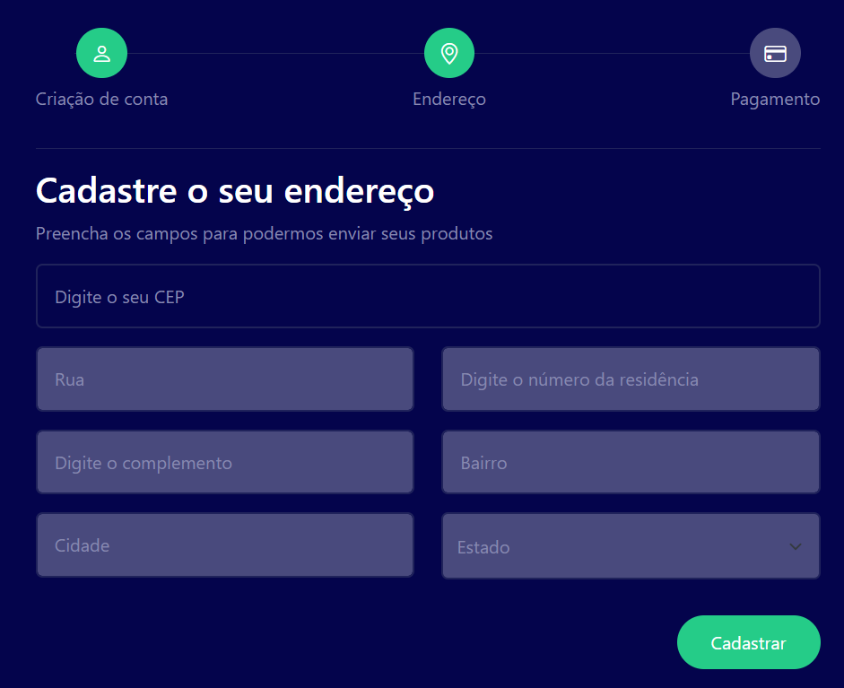

# buscaCEP com auto-complete

## Projeto busca CEP na API buscaCep, e autocompleta os campos👈 

### Tecnologias usadas: 👈 
 HTML , 
 CSS , 
 BOOTSTRAP , 
JAVASCRIPT , 
 VSCODE
 - Projeto Responsivo
   - Conteudo: Youtube horadecodar
